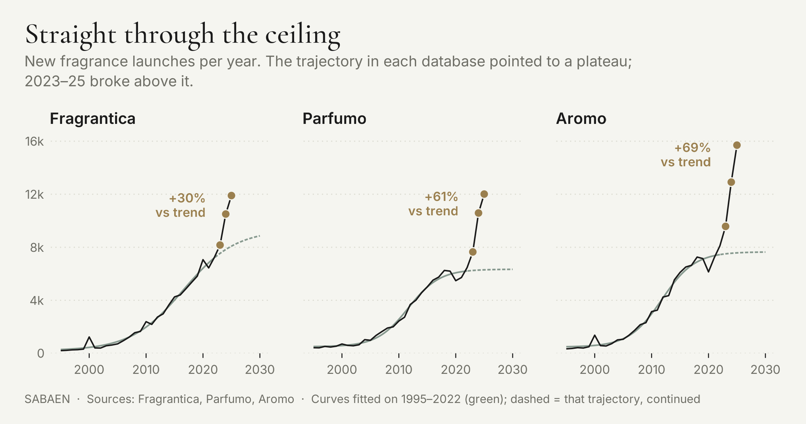

# The Hollow Perfume Boom — data and code

Data and R code to reproduce the models, headline numbers and figures in
[*The Hollow Perfume Boom*](https://sabaenresearch.substack.com/p/the-hollow-perfume-boom),
published in the [SABAEN Research](https://sabaenresearch.substack.com) newsletter.



## What is in here

```
data/
  launches_by_year_combined.csv   New fragrance launches per year, 1995-2025,
                                  as indexed by Fragrantica, Parfumo and Aromo
  driver_top_brands.csv           Launches per year for the Fragrantica brands
                                  that added the most between 2023 and 2025
scripts/
  fit_logistic.R                  4-parameter logistic fits on 1995-2022:
                                  ceilings, inflection years, 95%-saturation
                                  years, R-squared
  counterfactual_excess.R         Actual 2023-25 launches vs the pre-2022
                                  trajectory: per-year and combined excess
  plot_fig1.R                     Figure 1 (three series, fits, the break)
  plot_fig2.R                     Figure 2 (top-20 brand movers, dumbbells)
  theme_sabaen.R                  SABAEN house style for ggplot2
results/                          Outputs of the four scripts, as committed
```

## Running it

Requires R (tested on 4.x) with five packages:

```r
install.packages(c("drc", "ggplot2", "sysfonts", "showtext", "ragg"))
```

Then, from the repository root:

```sh
Rscript scripts/fit_logistic.R
Rscript scripts/counterfactual_excess.R
Rscript scripts/plot_fig1.R
Rscript scripts/plot_fig2.R
```

Each script prints its results and writes into `results/`. The figure scripts
fetch Cormorant Garamond and Inter from Google Fonts at render time; offline
they fall back to Georgia and Helvetica.

## What the article claims, and where it comes from

The article's argument rests on a simple before/after comparison. Launches
per year in all three databases followed a saturating S-curve through 2022: a
4-parameter logistic fitted on 1995-2022 explains each series with an
R-squared of about 0.99 (`fit_logistic.R`). Those fits put the ceilings at
roughly 6,300 launches per year (Parfumo), 7,700 (Aromo) and 9,300
(Fragrantica), with Parfumo and Aromo already past 95% of their ceilings by
2019-2020.

Continuing each fitted curve through 2025 gives the counterfactual: the
launch counts the pre-2022 dynamics would have produced. Actual counts broke
above that trajectory in all three databases (`counterfactual_excess.R`).
Across 2023-2025 combined, the excess is about +30% (Fragrantica), +61%
(Parfumo) and +69% (Aromo), and it widens every year: by 2025 the three
databases sit 47%, 91% and 107% above trend respectively.

The baseline cut sits at 2022 because 2023 already shows the disturbance
(+18% year on year on Parfumo and Aromo, against a +8.5-10% norm for the
preceding years), and 2023 is the first full year after the 2020-22 rollout
of algorithmic recommendation feeds on the major discovery platforms.

A small technical footnote: `fit_logistic.R` and `counterfactual_excess.R`
parametrise the year axis differently (offset from 2000 vs raw calendar
year). On the two settled series the resulting ceilings agree to within a
few units; on Fragrantica, whose ceiling has a standard error of ~11%, the
optimiser lands about 0.5% apart (9,369 vs 9,320). Both round to the ~9,300
quoted in the article.

## Data provenance

The launch counts were read from the public release-year listings of the
three databases in July 2026. This repository distributes the resulting
aggregate counts only.

Three caveats worth knowing before reusing the data:

- **One market, three databases.** Fragrantica, Parfumo and Aromo each index
  the same global fragrance market. The three columns are three views of one
  phenomenon, and they are correlated accordingly.
- **Catalogues backfill.** All three databases keep adding older products, so
  re-reading the same pages later will give somewhat higher counts,
  especially for recent years. The 2025 figures are the most provisional.
- **The brand table is censored.** `driver_top_brands.csv` records the ~150
  most prolific Fragrantica brands in each year. A value of 0 means the brand
  fell below that threshold in that year (in 2023 the threshold was 11
  launches per year).

## Licence

Code is released under the [MIT licence](LICENSE). The launch counts are
aggregate statistics derived from publicly accessible database listings;
Fragrantica, Parfumo and Aromo hold the rights to their respective catalogue
contents.
